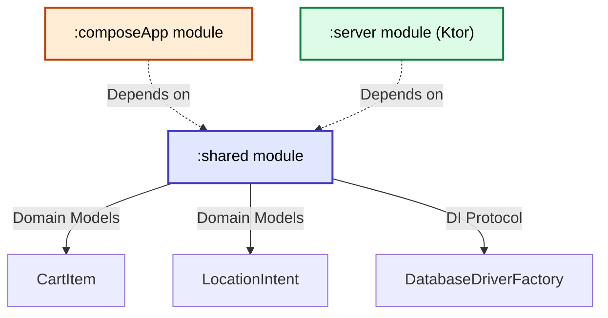

# Phase 1 Foundation Ledger

> [!INFO] Phase Summary
> The core structural scaffolding of "Cart-Near-Me" has been completed. The Kotlin Multiplatform (KMP) mono-repo is established with robust module separation, type-safe persistence, and a decoupled dependency injection layer.

## 2026 Tech Stack
- **Language**: Kotlin 2.1
- **Backend Framework**: Ktor 3.4
- **Dependency Injection**: Koin 4.0
- **UI Framework**: Compose Multiplatform 1.7
- **Persistence**: SQLDelight 2.0.2

## Architecture Cross-Links (Vault)
All major structural and strategic choices have been logged using our standard documentation templates.
- **[[ADR-001-Initial-Scaffolding]]** (Implicit/Foundation)
- **[[ADR-002-Kotlin-Multiplatform]]** (Implicit/Foundation)
- **[[ADR-003-Compose-UI]]** (Implicit/Foundation)
- **[[ADR-004-Ktor-Backend]]** (Implicit/Foundation)
- **[[ADR-005-Local-Persistence-Schema]]** - Established SQLDelight for local mapping.
- **[[ADR-006-Dependency-Injection-Strategy]]** - Transitioned completely to Koin.

## Data Contracts
Our primary intent-first data entities are established, documented, and fully linked:
- **[[Domain-CartItem]]**: Stores raw items semantically mapped to categories.
- **[[Domain-LocationIntent]]**: Orchestrates geographic search boundaries (Privacy-first).

## Wiring Diagram

